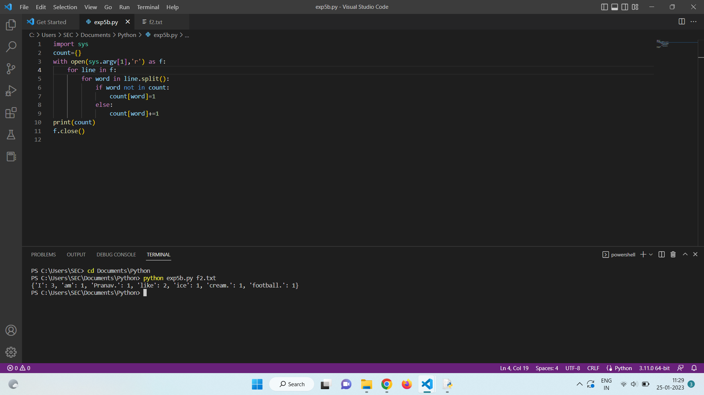

# command-line-arguments-to-count-word
## AIM:
To write a python program for getting the word count from the contents of a file using command line arguments.
## EQUIPEMENT'S REQUIRED: 
PC
Anaconda - Python 3.7
## ALGORITHM: 
### Step 1:
import sys library
### Step 2: 
Create an empty dictionary
### Step 3: 
Open then the file in read mode.
### Step 4:  
Use for loop to iterate through the file.
### Step 5: 
If the word already exists in the dictionary,increment its value by 1 else initialize it to 1.
### Step 6: 
Print the dictionary.
## PROGRAM:
```python
'''
Program to count the number of words from a file
Developed By:A.J.PRANAV
Reference number:22008772
'''
import sys
count={}
with open(sys.argv[1],'r') as f:
    for line in f:
        for word in line.split():
            if word not in count:
                count[word]=1
            else:
                count[word]+=1
print(count)
f.close()
```

### OUTPUT:

## RESULT:
Thus the program is written to find the word count from the contents of a file using command line arguments.
